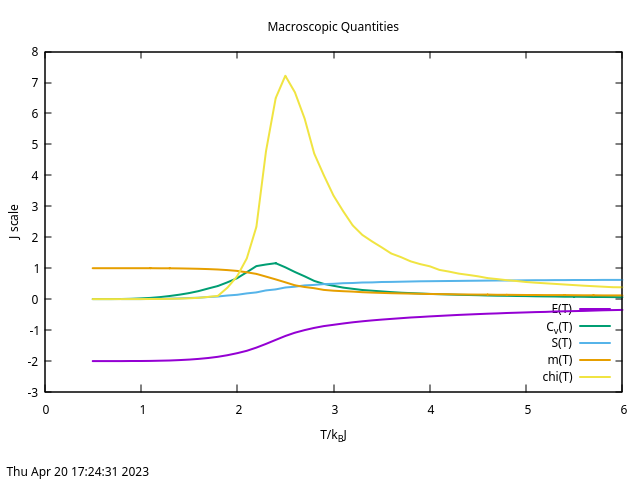
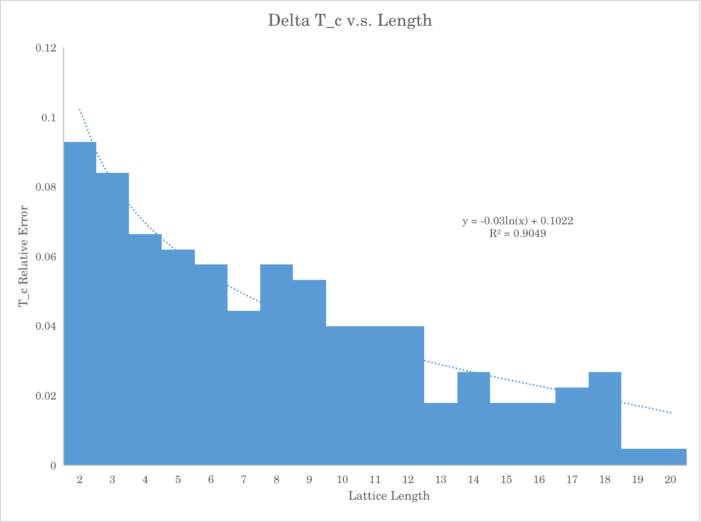

# Post Analysis

The nature of the metropolis algorithm is an algorithm that implement the idea of Monte-Carlo Markov chain with a detailed balance condition that follows the Boltzmann distribution.[^1] One could implement this algorithm for the Ising model- a model describing interacting spins with interaction energy $J$ and an external magnetic field $h$ on a $n$ dimensional lattice.

The solution for one-dimensional Ising model a canonical topic in many statistical mechanical textbook. The analytical solution for two-dimensional model, however, is quite complex. One famous solution to this problem with a vanishing field is Onsager's solution on an infinite lattice.[^2] I will compare my result with Onsager's solution in limiting behaviors.

## Validation

### Statistical Error

In an ideal model, we should perform a $\chi^2$ test that compares Onsager's result directly to the numerical result. The issue to this approach is that the metropolis algorithm is an algorithm based on sampling on a randomly generated initial state. Naively, we should expect an relative error:
$$
\frac{\Delta X}{X} \sim \frac{1}{\sqrt{N}}
$$
where $X$ is some directly sampled quantity, and $N$ is the sample size. Suppose for each sample, we then take the average of $N'$ values in each sample, this gives a preliminary estimation of the sampling error at large $N$:
$$
\frac{\Delta X}{X} \sim \frac{1}{\sqrt{N N'}} \leq \sqrt{\frac{1}{N} + \frac{1}{N'}} \tag{1}
$$
This is a very drastic simplification of the actual problem. While each sample is indeed uncorrelated (up to the RNG process), the process of taking the average of multiple Monte-Carlo steps in one sample($N'$) is certainly correlated. In an ideal world, we should find the correlation time via autocorrelation function (number of MC steps) and decouple the correlation, but finding the correlation time itself could be computationally taxing.

By the power of physics intuition:tm:, we can estimate the correlation time to be on the order of $L^2$- the two-dimensional size of the lattice. This is because since the Metropolis algorithm are flipping a random spin each step, we could expect the spins to decouple after the number of expectation of the size of the lattice. 

Here is my code implementation to address the auto-correlation issue:

```c++
    int mc_steps = 200; 		   // amount of step to take average
                                   // get the total amount of energy over the
                                   // num_average iterations of the microstate.
    double total_energy = 0;
    for (int i = 0; i < mc_steps; i++) {
      microstate_ptr->evolve_microstate(row * col * 5); // remove autocorrelation
      total_energy += (Hamiltonian::hamiltonian_periodic_ising_microstate(
          microstate_ptr->get_microstate_matrix_ptr(), hamiltonian_param_ptr));
    }

```

Here, $N'$ corresponds to `mc_steps`. Because of this implementation, I believe $(1)$ is a valid approximation of our error! For the data that I will demonstrate, I used $N = N' = 200$. Therefore,  for data that I will demonstrate below, the relative error coming from statistical error could be estimated as:
$$
\frac{\Delta X}{X} \sim \sqrt{\frac{1}{N} + \frac{1}{N'}} \tag{1} \approx 0.1
$$
This means from statistical error alone, we have almost 10 percent error. Increasing the sample size will of course reduce this number.

One issue that I have to address is that my implementation also generates quantities that are **not** directly generated from sampling. These quantities are $C_v(T), S(T), \chi(T)$ which are themselves variance of $E(T), m(T)$ directly. I will not perform error analysis on the variance on these values, but note that the values of $C_v(T), \chi(T)$ themselves is a good measurement of the variance of $E(T)$ and $m(T)$. We can observe from one sample run with $10 \times 10$ lattice below:



We note that $C_v, \chi(T)$ peaks around $T = 2.3J$, indicating the variance on $E(T)$ and $m(T)$ is significantly higher on this region. Note that this is the critical region where temperature is near Onsager's critical temperature calculation $\sim 2.269 J$. 

### Truncation Error

Aside from pure statistical error, the computational method also has truncation error. This is because Onsager's solution assumes an infinite lattice, where the lattice size we simulation if far from infinite. Therefore, we should evaluate the truncation error as well.

I have compiled a [file](Analysis_data.xlsx) that contains the raw data and errors of certain macroscopic quantities. 

#### Critical Region Error

Specifically, I analyzed the error on $T_c$ by subtracting the numerical maximum of $C_v$ with Onsager's exact solution. This gives us the behavior of truncation error near the critical region. This is the result: 

Our result is relative messy. However, we can at least see a decreasing trend of the relative error of $T_c$ as $L$ increaes.


#### Asymptotic Error

Additionally, I have also calculated $m(T)$ when $T > T_c$. Due to the phase transition, the exactly solution for $m(T)$ should be $0$.  I chose $m(T)$ because it has a simple expression when $T>T_c$, and it is directly sampled  from the micro-state:_vs_ln(L).png)

Here, I have discovered that the log-log graph for $\Delta m$ v.s. $L$ appears to show linearity with $R^2$ value $0.9995$. This indicate that the truncation error for $m$ goes like:
$$
\Delta m \sim O(L^{-1})
$$

 ### Summary on Error Analysis

We have given a rough estimate for the statistical error and how it scales with sample size $N$, and we have also explored the truncation error near the critical temperature and asymptotic behavior. 

It is notable that  the statistical error increases near $T_c$, and the truncation error scales poorly near $T_c$ when compared with asymptotic behavior. These factors combined means that the error near $T_c$ is much more larger and it is more difficult to remove. We shall discuss more on this in section `Further Optimizations`.

Even with these errors, we could see that one instance of $N=1000$ sample for a $20 \times 20$ lattice give us:

| Exact                     | Sample    | Err       |
| ------------------------- | --------- | --------- |
| $T_c = 2.2691$            | $2.28$    | $4.8\%$   |
| $m(0) = -1$               | $0.9999$  | $\sim 0$  |
| $m(T>T_c) = 0$            | $0.0604$  | $0.0604$  |
| $S(T_{large}) \to \ln(2)$ | $0.6047$  | $12.8 \%$ |
| $U(0) = -2$               | $-1.9999$ | $\sim 0$  |


 We can see that our data is pretty valid for most quantities. Note that our $S(T)$ is only evaluated up to $S(T=6J/k_B)$ with additional numerical integration error $\propto O(\delta T^4)$. In general, I think our computation is valid.

## Computational Time Complexity

We can estimate the computational time complexity with parameter lattice length $L$. The automatic recommended cooling iteration number is $L^2 \cdot 1000$, so natively, we theorize that:
$$
T \sim O(L^2)
$$
We can validate this by running ten sample of the simulation at different sizes with automated iteration number and only one thread: _vs_ln(L).png)

A log-log diagram reveals that the relationship of computation time versus lattice length does appear to follow a power law:
$$
T \sim O(L^2)
$$
Now let us investigate which process is taking the most time with `gprof`

```
Flat profile:

Each sample counts as 0.01 seconds.
  %   cumulative   self              self     total           
 time   seconds   seconds    calls  Ts/call  Ts/call  name    
 39.55     78.17    78.17                             Microstate::evolve_microstate_once()
 26.87    131.27    53.10                             Hamiltonian::hamiltonian_periodic_ising_element(int, int, Eigen::Matrix<double, -1, -1, 0, -1, -1>*, hamiltonian_param_struct*)
 17.93    166.70    35.44                             Microstate::evolve_microstate_gradual(int)
  7.10    180.74    14.04                             TLS init function for global_rng
  5.36    191.33    10.59                             random_unitary_double()
  1.98    195.24     3.91                             std::mersenne_twister_engine<unsigned long, 32ul, 624ul, 397ul, 31ul, 2567483615ul, 11ul, 4294967295ul, 7ul, 2636928640ul, 15ul, 4022730752ul, 18ul, 1812433253ul>::_M_gen_rand()
  0.40    196.03     0.79                             Hamiltonian::hamiltonian_periodic_ising_microstate(Eigen::Matrix<double, -1, -1, 0, -1, -1>*, hamiltonian_param_struct*)
  0.33    196.68     0.65                             Microstate::Microstate(int, int, double, hamiltonian_param_struct*)
  0.12    196.92     0.24                             _dl_relocate_static_pie
  0.02    196.95     0.03                             std::ctype<char>::do_widen(char) const
  0.02    196.98     0.03                             _init
  0.01    196.99     0.02                             random_integer(int)
  0.01    197.00     0.01                             Microstate::evolve_microstate(int)

```

We can see that the bottleneck is in `Microstate::evolve_microstate_once()`. I can do some further investigation, but my guess is that every time we call the method, the method evaluate the Boltzmann constant to determine if we accept a spin flip with $\Delta E > 0$, which is very inefficient. I have suggested a look-up method in section `Further Optimization`.

## Further Optimizations

Although we have achieve most of the functionality that were intended, there are certainly more optimizations that we can do:

1. Do not use `Eigen`for matrix representation to represent our micro-state. This is a design error made by me from early-on. For our purpose, the "matrix" is nothing but a list of numbers, and we do not require any transformation of matrix actions. Therefore, using `Eigen` will create overhead. Instead, we should use a col-major `std::vector` flat vector array for better memory layout.[^3]
2. In `Microstate.cpp`, the `evolve_once` method is evaluating the Boltzmann factor every time each spin flip happens.  However, this is very unnecessary because for our problem, the Boltzmann factor can only be `{-8,-4,0,4,8} * J + 2 * h`. Therefore, a more effective way is to created a `map` with `{key= DeltaE, value = exp(-DeltaE/temperature)}`. This will be faster because `map` look-up time is lower than `exp()`function call.
3. As we discovered, quantities near $T_c$ has more variance. Therefore, our code should ideally be adaptive with parameter $t=(T-T_c)/T_c$.
4. Near $T_c$, we should probably have a probability of flipping not only a random spin, but its closest neighbors as well. I have thought about implementing this but I didn't have time, and I believe this is a already established algorithm from things I heard from my statistical mechanics class. 
5. There are more quantities to be observed, including correlation length $\xi$ and re-normalization factors(e.g. $\beta, \gamma,\Delta \dots$).
6.  Properly create a graphing pipeline.
7. When storing data, the code relies on a directory `/6810_final/data`, maybe run `System("mkdir -p ../data")` to ensure the directory is there.
8. Make the program loop-able. Currently, both the calculation and graphing mode is inheriting the previously calculation for some unknown reasons.


## References:

1. Chib, Siddhartha; Greenberg, Edward (1995). "Understanding the Metropolis-Hastings Algorithm". The American Statistician. 49 (4): 327–335 – via JSTOR.
2. [Onsager, Lars](https://en.wikipedia.org/wiki/Lars_Onsager) (1944), "Crystal statistics. I. A two-dimensional model with an order-disorder transition", *Phys. Rev.*, Series II, **65** (3–4): 117–149, [Bibcode](https://en.wikipedia.org/wiki/Bibcode_(identifier)):[1944PhRv...65..117O](https://ui.adsabs.harvard.edu/abs/1944PhRv...65..117O), [doi](https://en.wikipedia.org/wiki/Doi_(identifier)):[10.1103/PhysRev.65.117](https://doi.org/10.1103%2FPhysRev.65.117), [MR](https://en.wikipedia.org/wiki/MR_(identifier)) [0010315](https://mathscinet.ams.org/mathscinet-getitem?mr=0010315)
3. Bendersky, Eli (2015), "Memory layout of multi-dimensional arrays", Eli Bendersky's website, https://eli.thegreenplace.net/2015/memory-layout-of-multi-dimensional-arrays

#### 
